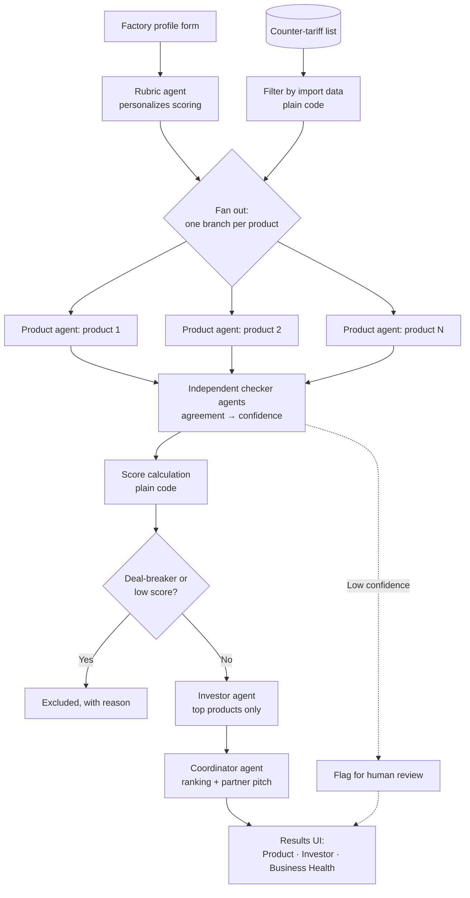

# ForgeNorth

**Tariffs Up. Business Up.**

🔗 **[Try the live prototype](https://reshore-catalyst.lovable.app/)**

ForgeNorth is a multi-agent AI assistant that helps Canadian manufacturers find new products they could start making as tariffs reshape cross-border trade. It scores each opportunity on product fit, partner potential and the factory's own readiness, and it says when it isn't sure.

> ⚠️ **Status: prototype.** ForgeNorth was built in one day at the *Build for Canada: An AI Hackathon for Economic Resilience* (NovaForge AI Venture Lab, Toronto, October 2026). This repository contains a working results interface driven by a defined data contract, using illustrative sample data. The multi-agent pipeline described below is the intended design; parts of it are not yet implemented. See [What this prototype includes](#what-this-prototype-includes) for exactly what exists today.

## At a glance

- **Problem:** Canada's counter-tariffs make many US-made goods ~25% pricier, opening room for Canadian factories, but small manufacturers can't easily tell which products they could make, or whether it would still pay off if tariffs end.
- **What it does:** For a specific factory, ForgeNorth shortlists tariff-affected products it could make and scores each on **product fit**, **partner potential** and **business readiness**, with evidence for every score.
- **Key idea:** Independent AI agents answer each judgment call separately; when they disagree, the answer is flagged as low-confidence for human review instead of being presented as fact.
- **Architecture:** Multi-agent where judgment is needed (parallel research, independent checking), plain code for lookups and math, one shared scorecard as memory.
- **Status:** One-day hackathon prototype: results UI and data contract built, agent pipeline designed and partly implemented.
- **Skills shown:** Agentic AI design, uncertainty quantification, problem framing, scoping under time pressure.

---

## Table of contents

1. [The problem](#the-problem)
2. [The idea](#the-idea)
3. [Design decisions and trade-offs](#design-decisions-and-trade-offs)
4. [What ForgeNorth assesses](#what-forgenorth-assesses)
5. [How scoring works](#how-scoring-works)
6. [Knowing when not to trust an answer](#knowing-when-not-to-trust-an-answer)
7. [How the multi-agent workflow functions](#how-the-multi-agent-workflow-functions)
8. [What this prototype includes](#what-this-prototype-includes)
9. [Limitations](#limitations)
10. [Roadmap](#roadmap)

---

## The problem

Canada's counter-tariffs on US goods (including steel and aluminum, appliances, agricultural equipment, plastics and electronics) make many US-made products roughly 25% more expensive in Canada.

That is a cost for Canadian buyers, but it is also an opening: a Canadian factory can now compete on price for products it previously couldn't. The trouble is that a small manufacturer usually has no analyst to answer the questions that matter:

- Which tariff-affected products could *my* factory actually make?
- Would it still make sense if the tariffs were removed next year?
- Can I afford it, and could I find a partner to share the risk?

## The idea

ForgeNorth starts from a **specific Canadian factory**, not from a list of products, and works outward:

1. Find US-made products now hit by Canada's counter-tariffs that Canada imports in meaningful amounts.
2. Check which of them this factory could realistically make.
3. Score each opportunity on three dimensions: **product**, **investor**, and **business health**.
4. Explain every score with evidence, and flag answers the system is unsure about.

**The end user** is the owner of a small or mid-sized Canadian manufacturer, for example a 30-person metal fabrication shop in the Toronto area with existing machines and some spare capacity.

**A guiding principle:** the tariff is treated as a *bonus*, not the reason to invest. Tariffs can be reversed, so ForgeNorth favours opportunities that still make sense without them, and shows every product's score both with and without the tariff.

## Design decisions and trade-offs

The idea changed substantially during the day. These are the decisions that shaped it, and why.

**Choosing the problem.** Most teams built research assistants for small businesses. I looked for a narrower problem with a clear end user and a substantial, measurable benefit. I set aside ideas that only *moved* a loss between Canadian businesses (for example, helping a contractor pass tariff costs on to a Canadian client), because they don't make Canada more resilient as a whole. I also rejected any approach involving routing goods through third countries to disguise their origin, since tariffs are based on where goods are made and that would be customs fraud.

**Starting from the factory, not the product.** "Find products to make in Canada" is vague. "Given *this* factory's machines, which tariff-affected products could it make?" is specific and answerable.

**Treating the tariff as a bonus.** The hardest question a partner would ask is *"Why invest if the tariff disappears next year?"* The answer is built into the scoring: favour products with lasting advantages and low-commitment partnerships, and show the without-tariff scenario explicitly.

**Brand risk.** A new Canadian product can't use the US brand's name. ForgeNorth favours products bought on price and specs, usually by businesses, and proposes contract manufacturing so the partner's brand can stay on the product.

**Removing double counting.** An early version scored "lasting advantages" in both the product and investor dimensions, counting the same facts twice. The investor question was replaced with *partnership risk*, which the product questions don't cover.

**Fixed questions, personalized calibration.** Fully personalized questions would make scores incomparable across products and companies. Keeping the nine questions fixed while adapting level definitions, relevant factors and weights to each industry and product gives both comparability and fairness. The PoC uses a single hand-written rubric for metal fabrication; generating it dynamically is the next step.

**Scope for a one-day build.** The full design has 13 steps. For the prototype, the priority was the part that demonstrates the idea end to end: the scoring model, the uncertainty display and the data contract.

## What ForgeNorth assesses

Each opportunity is assessed on three dimensions, three questions each.

### 1. Product: is this worth making in Canada?

| Question | What it captures |
|---|---|
| How many key materials are available without the tariff? | Whether the new product would hit the same tariffs through its inputs |
| How much do buyers care about the brand? | Whether a new, unbranded Canadian product can win buyers who choose on price and specs |
| How many lasting advantages does it have? | Advantages that survive tariff removal: costly to ship, uses Canadian materials such as Quebec aluminum, exportable to Europe or Asia under Canada's trade agreements |

### 2. Investor: will a partner want in?

The target partner is a US company whose Canadian sales are hurt by the tariffs. The proposal is low-risk **contract manufacturing**: the Canadian factory makes the product for the Canadian market, so the partner keeps its Canadian customers without building a plant.

| Question | What it captures |
|---|---|
| How big is Canada as a market for them, for this product? | Whether they have something to lose |
| How much is their Canadian business hurt by the tariff? | How urgent the problem is for them |
| How low-risk is the partnership for them? | Whether they can commit without betting on the tariff lasting |

### 3. Business health: can the factory actually do it?

| Question | What it captures |
|---|---|
| How much new equipment is needed? | Fit with existing machines and skills |
| How much spare capacity is there? | Time, workers and floor space |
| How would the start-up cost be paid? | Own cash, or likely eligibility for government tariff support (e.g. the Regional Tariff Response Initiative or BDC programs) |

## How scoring works

Every question has four concrete answer levels:

| Level | Fit score | Example (new equipment needed?) |
|---|---|---|
| Best | 100% | None |
| Good | 67% | Minor |
| Weak | 33% | Major |
| Poor | 0% | Needs a different factory |

- **Area score** = average of its three questions.
- **Risk level:** 75% or more is low risk, 50–74% medium, below 50% high.
- **Deal-breakers:** a product that only works because of the tariff, or that the factory can't make, is excluded regardless of its other scores.
- **Two scenarios:** each product is scored *with tariff* and *if tariff removed*.
- **Evidence:** every answer comes with three insight bullets and their sources.
- **Personalization within a fixed frame:** the nine questions never change, so products can be compared. What adapts is the calibration. "Minor equipment" means something different for a 10-person shop than for a 200-person plant, and weights reflect the owner's priorities.

### PoC rubric vs. dynamic rubric

> **The questions and scale are fixed so products can be compared; the evidence each question looks at adapts to the industry and product.**

The rubric in this repository is a **PoC rubric**: hand-written for one example case, a Toronto-area metal fabrication shop evaluating tariff-affected metal products such as aluminum ladders. Its answer levels, lasting-advantage factors and examples reflect that industry.

In the full design, a **rubric agent** generates the rubric dynamically for each factory, industry and product, while keeping the nine core questions fixed:

| What adapts | Based on | Example |
|---|---|---|
| Meaning of each answer level | Company size and industry | "Minor equipment" is ~$25K for a small metal shop, far more for a food processor needing certified lines |
| Which lasting advantages count | Industry and product | Metal: shipping weight, Canadian aluminum. Food: shelf life, freshness, local sourcing |
| Weights across questions | Owner's priorities | A cash-constrained owner weights affordability; a growth-focused one weights lasting advantages |
| Follow-up checks | Product-specific requirements | Safety-certified ladders → "Can you obtain this certification?" Shown as a flag, not added to the score |
| Grant programs checked | Region | Southern Ontario → FedDev Ontario programs |

**Why only the details adapt, not the questions:** if every product were judged by different questions, scores couldn't be compared ("ladders 78% vs. brackets 55%" would be meaningless), and the system would be harder to test. Each generated rubric is stored in the shared scorecard, so anyone can see why a level was defined the way it was.

These are **fit scores, not probabilities.** "67%" means a good fit on that question, not a 67% chance of success.

Example output (illustrative numbers):

| Question | Answer | Fit score | Confidence | Insights |
|---|---|---|---|---|
| Lasting advantages? | 2 | 67% | High | • Bulky to ship, so cross-border freight is costly<br>• Canadian aluminum gives a steady local supply<br>• EU export possible under CETA after certification |
| Canada as their market? | Moderate | 67% | **Low ⚠️** | • Canada is a major destination for US exports of this product type<br>• The company's own Canadian sales figures aren't public<br>• Agents disagreed, so a person should check |

## Knowing when not to trust an answer

The central technical idea in ForgeNorth is that **confidence is measured, not asked for.**

Language models tend to sound equally sure whether they are right or wrong, and asking a model for its own confidence is known to be poorly calibrated. Instead, for each judgment question, **two to three agents answer independently**, with different prompts or models and without seeing each other's work:

- **They agree:** confidence is High.
- **Minor disagreement:** confidence is Medium.
- **They disagree:** confidence is Low, the item is flagged for human review, and the interface shows each agent's answer and reasoning.

Two choices keep this honest:

1. **Score and confidence are stored separately.** An early version used answer options like "most likely", which mixed *how much* something is true with *how sure* we are. Concrete options ("All / Most / Some / None") capture the degree; agent agreement captures the certainty.
2. **Concrete answer levels make disagreement meaningful.** When options are vague, agents disagree because they read the scale differently. When options are concrete, disagreement is more likely to reflect a genuinely unclear case.

This builds on my Master's thesis, where I used ensemble disagreement to flag high-uncertainty predictions in a healthcare decision-support model. Disagreement-based uncertainty is a well-established baseline for language models (sampling consistency), but uncertainty quantification for multi-step *agents* remains an open research area. The planned next step is to calibrate these confidence levels with **conformal prediction** on a labelled set (see [Roadmap](#roadmap)).

## How the multi-agent workflow functions

### Guiding rule: agents where judgment is needed, code where it isn't

Not every step needs an agent. Lookups and arithmetic are done in plain code, which is faster, cheaper and more reliable. Agents are reserved for steps that need research or judgment, where neither fixed rules nor traditional ML (which would need labelled training data that doesn't exist) would work.

| # | Step | Agent? | Why |
|---|---|---|---|
| 1 | Owner fills in a factory profile (machines, staff, cash, priorities) | ❌ No | A form |
| 2 | Personalize the scoring rubric for this factory | ✅ Yes | **Rubric agent:** judgment about the business |
| 3 | Load US products on Canada's counter-tariff list | ❌ No | Published government list |
| 4 | Keep products Canada imports in meaningful amounts | ❌ No | Lookup in Statistics Canada trade data |
| 5 | Answer product questions | ✅ Yes | **Product agents:** research and judgment, one per product, in parallel |
| 6 | Answer equipment and capacity questions | ✅ Yes | **Business-fit agent:** compares product needs with factory profile |
| 7 | Determine how start-up would be paid | ⚙️ Partly | Cost math in code; grant eligibility check by an agent |
| 8 | Measure agreement on each answer | ✅ Yes | **Independent checker agents:** disagreement sets confidence |
| 9 | Compute fit scores, risk levels, with/without-tariff scenarios | ❌ No | Arithmetic |
| 10 | Find potential US partners and answer investor questions | ✅ Yes | **Investor agent:** web research, top products only |
| 11 | Write three insight bullets per answer | ✅ Yes | Written by the agent that produced each answer |
| 12 | Rank products and draft a partner pitch | ✅ Yes | **Coordinator agent:** reads the full scorecard and writes |
| 13 | Display results | ❌ No | User interface |

### Workflow



### Shared memory

All agents read from and write to **one shared scorecard** rather than passing messages to each other. Each answer records the score, the reasoning, the evidence and whether independent agents agreed:

```json
{
  "factory": { "name": "...", "machines": [], "capacity": "...", "priorities": [] },
  "rubric": { "level_definitions": {}, "weights": {} },
  "products": {
    "aluminum_ladders": {
      "product": {
        "materials_without_tariff": {
          "answer": "All",
          "fit": 100,
          "confidence": "High",
          "insights": ["...", "...", "..."],
          "sources": ["..."],
          "agent_opinions": [{ "agent": "A", "answer": "All", "reason": "..." }]
        }
      },
      "investor": {},
      "business_health": {},
      "score_with_tariff": 78,
      "score_without_tariff": 70
    }
  }
}
```

This structure is also the **contract between the agent pipeline and the interface**: as long as agents output this shape, the UI works unchanged.

### Why multi-agent, and not one agent?

An honest question I asked during design was whether this needed multiple agents at all. Much of the workflow could be done by a single agent with tools, and splitting simple steps into separate agents would only add complexity. Multiple agents are used only where they add something a single agent can't:

1. **Independence.** Disagreement only signals uncertainty if the answers are produced separately. One agent asked three times tends to repeat itself.
2. **Parallel, focused research.** One agent per product researches at the same time, each without being distracted by the others.
3. **Specialist roles.** Product, investor and business questions need different research strategies and sources.

**Planned framework:** LangGraph, which provides the shared state object, parallel branches and conditional routing (e.g. low confidence → human review) natively, and allows a different model per node, which helps keep checker agents independent. Plain Python with `asyncio` is a viable lighter alternative.

## What this prototype includes

| Component | Status |
|---|---|
| Results interface: three columns (Product, Investor, Your Business Health), area scores, risk badges, fit scores, confidence badges, three insights per answer, "see why agents disagreed" view | ✅ Built |
| JSON data contract between pipeline and interface | ✅ Defined |
| Scoring model, answer levels, risk thresholds, deal-breakers | ✅ Designed |
| PoC rubric, hand-written for metal fabrication | ✅ Built |
| Dynamic rubric generated per industry and product by the rubric agent | 🔲 Designed, not implemented |
| Sample data for an example Toronto-area metal shop and tariff-affected metal products | ✅ Illustrative (not real analysis) |
| Agent pipeline (rubric, product, checker, investor and coordinator agents) | 🔲 Designed, not fully implemented |
| Live data integration (counter-tariff list, Statistics Canada trade data, web research) | 🔲 Planned |
| Evaluation on labelled cases | 🔲 Planned |

<!-- Update the table above to match exactly what the code in this repo does. -->

## Limitations

- **Estimates, not guarantees.** Outputs are a shortlist to investigate, based on public data and AI research, not financial or legal advice.
- **Investor data is thin.** Public companies report sales by region; private companies mostly don't, so company-level Canadian exposure is often estimated.
- **Product-level vs. company-level data.** Trade statistics show how much of a product's US exports go to Canada, not how dependent a specific company is on Canada.
- **Policy changes often.** Tariff lists and support programs change; results depend on keeping inputs current.
- **Agreement isn't correctness.** Different models can share the same mistakes, so high agreement reduces risk but doesn't eliminate it. This is why calibration and evaluation are the next priorities.

## Roadmap

1. **Implement the agent pipeline** in LangGraph, wired to the existing data contract.
2. **Dynamic rubric generation**, so the system works across industries (food, plastics, wood products, electronics) rather than only the PoC's metal fabrication case.
3. **Evaluate it.** Hand-label test cases and measure answer accuracy, and how often disagreement flags catch real errors, compared with a single-agent baseline (e.g. AUROC of uncertainty vs. error, and a selective accuracy–coverage curve).
4. **Calibrate confidence with conformal prediction**, so the system can offer a guaranteed coverage rate for its answers.
5. **Use real data:** counter-tariff list, Statistics Canada import data, and live supplier and partner research.
6. **Grant matching and partner pitches** for every top-ranked product.

## Running the prototype

**Live demo:** [reshore-catalyst.lovable.app](https://reshore-catalyst.lovable.app/) (no setup needed; uses illustrative sample data).

To run it locally:

<!-- Replace with the actual steps for this repo, for example: -->

```bash
git clone https://github.com/EhsenSiddiqui/forge-north.git
cd forge-north
# install dependencies and start the app (see project files)
```

## Acknowledgments

Built at **Build for Canada: An AI Hackathon for Economic Resilience**, hosted by NovaForge AI Venture Lab and My Creative Break, Toronto, October 2026.

## Author

**Mohammad Ahsan Siddiqui**, data scientist and ML researcher (MSc Computer Science, Western University)
[LinkedIn](https://linkedin.com/in/mohammad-ahsan-siddiqui-897298174) · [GitHub](https://github.com/EhsenSiddiqui)
